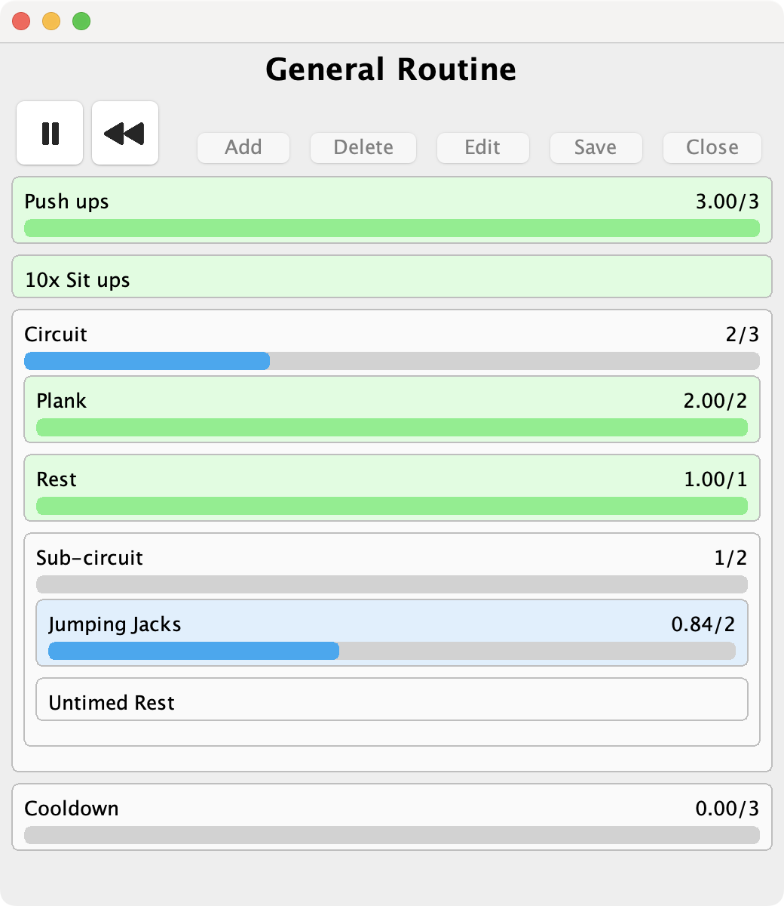
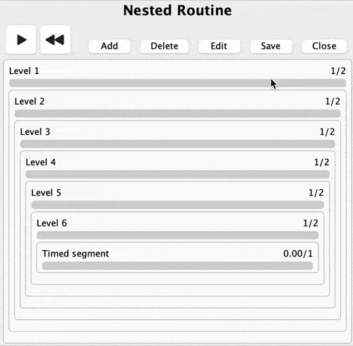

  <h1>WorkoutTimer</h1>

**WorkoutTimer** is a Java desktop application to create custom workout routines, or any other timer-based routine! 
Each routine consists of a series of three different elements:
1. **Timed segments** — complete when the specified time is elapsed
2. **Untimed segments** — complete when the user manually continues
3. **Repeat segments** — complete when a group of  sub-segments have completed a certain number of times 
   - Can contain other *Repeat segments*, allowing for arbitrary nesting of segments!

Originally created as part of a school software construction class (Final project for CPSC 210 at UBC). 

Primarily for use by anyone with an interval-based workout routine (E.g. bodyweight exercises, yoga, etc.). **But 
it's not just for workouts!** Can be used in any other situation with 
defined procedures of timed/untimed segments. 
*For 
example:*
1. Studying / productivity time management 
(e.g. [Pomodoro technique](https://en.wikipedia.org/wiki/Pomodoro_Technique), 
[52/17 Rule](https://en.wikipedia.org/wiki/52/17_rule))
2. Interview practice (e.g. MMI timing)
3. Lab protocols
4. Cooking / baking

  
   
  <i>Accidental binary counting in a deeply nested routine of repeat segments??</i>

